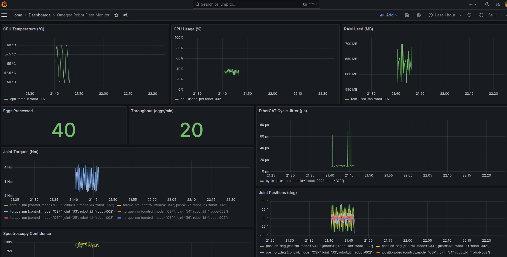

# Omegga Robot Monitoring Stack

```
Greengrass Component (robot)
        ↓ IPC (Unix socket)
Greengrass Nucleus
        ↓ MQTT over TLS (port 8883)
AWS IoT Core
        ↓ MQTT over TLS (port 8883)
subscriber.py
        ↓ HTTP (influxdb-client uses REST API over HTTP)
InfluxDB
        ↓ HTTP (Grafana queries InfluxDB via REST API)
Grafana Dashboard
```

---

## 1. Greengrass Component (on robot)

### Test locally without Greengrass
```bash
cd greengrass-telemetry
pip install -r requirements.txt
python3 main.py --mock --robot-id robot-001
```

### Sample Data
```json
{
  "robot_id": "robot-001",
  "timestamp_ms": 1779021270432,
  "motorcortex": {
    "state": "RUNNING",
    "control_mode": "CSP",
    "joint_positions": [-7.095, -1.709, -6.155, -4.198,  9.508, -1.343],
    "joint_velocities": [-13.373, -3.555,  7.598,  5.269, -1.927,  0.531],
    "joint_torques":    [  1.904,  6.407,  1.515,  2.071,  1.870,  0.981]
  },
  "ethercat": {
    "state": "OP",
    "slave_count": 6,
    "lost_frames": 0,
    "cycle_jitter_us": 9.6,
    "cycle_time_ms": 0.9996
  },
  "spectroscopy": {
    "sensor_status": "OK",
    "egg_detected": false,
    "classification": "none",
    "confidence": 0.0,
    "wavelength_nm": 850,
    "intensity": 0.603,
    "calibration_drift_pct": 0.311
  },
  "system": {
    "cpu_temp_c": 57.6,
    "cpu_usage_pct": 25.7,
    "ram_used_mb": 574.0,
    "ram_total_mb": 2048,
    "disk_used_gb": 8.61,
    "uptime_s": 11
  },
  "production": {
    "eggs_processed": 3,
    "cycle_count": 11,
    "throughput_per_min": 16.4
  }
}
```

### Deploy via Greengrass
```bash
# Build component locally
gdk component build

# Deploy component locally
sudo /greengrass/v2/bin/greengrass-cli deployment create --merge "com.omegga.telemetry=1.0.5"

# Publish component to IoT Core
gdk component publish

# Remove component
sudo /greengrass/v2/bin/greengrass-cli deployment create --remove "com.omegga.telemetry"

# Check running components
sudo /greengrass/v2/bin/greengrass-cli component list

# Deploy to all robots from cloud
aws greengrassv2 create-deployment \
  --target-arn arn:aws:iot:<your-region>:<your-account-id>:thing/<your-thing-name> \
  --components '{
    "aws.greengrass.Nucleus":  {"componentVersion":"2.17.0"},
    "aws.greengrass.Cli":      {"componentVersion":"2.17.0"},
    "com.omegga.telemetry":    {"componentVersion":"1.0.5"}
  }' \
  --region <your-region>
```

### Info

#### {artifacts:decompressedPath}
When the Nucleus unpacks `greengrass-telemetry.zip`, it places the contents on the robot's filesystem at:
```
/greengrass/v2/packages/artifacts-unarchived/com.omegga.telemetry/1.0.5/
```
That full path is what `{artifacts:decompressedPath}` resolves to.

#### --target-arn
```
arn:partition:service:region:account-id:resource
 │      │        │       │        │         │
 │      │        │       │        │         └── what specifically
 │      │        │       │        └──────────── your AWS account
 │      │        │       └───────────────────── where
 │      │        └───────────────────────────── which AWS service
 │      └────────────────────────────────────── aws / aws-cn / aws-us-gov
 └───────────────────────────────────────────── always "arn"
```

Example:
```
arn:aws:iot:<your-region>:<your-account-id>:thing/<your-thing-name>
```

---

## 2. Start InfluxDB + Grafana

Copy the example environment file and fill in your values:
```bash
cp influxdb-grafana/.env.example influxdb-grafana/.env
```

Then start the stack:
```bash
docker compose up -d
```

- InfluxDB: http://localhost:8086 (admin / see .env)
- Grafana:  http://localhost:3000 (admin / admin)

### Grafana
It uses `influxdb.yml` for datasource and `robot-fleet.json` for the dashboard, loaded automatically via provisioning on startup.

---

## 3. Start the MQTT Subscriber

```bash
# Set your AWS IoT Core endpoint and cert paths
export MQTT_HOST="<your-endpoint>.iot.<your-region>.amazonaws.com"
export MQTT_CERT="/path/to/certificate.pem"
export MQTT_KEY="/path/to/private.key"
export MQTT_CA="/path/to/AmazonRootCA1.pem"
export INFLUX_TOKEN="<your-influxdb-token>"

python3 subscriber.py
```

> **Tip:** Get your IoT Core endpoint with:
> ```bash
> aws iot describe-endpoint --endpoint-type iot:Data-ATS --region <your-region>
> ```

---

## 4. View Dashboard

Open Grafana at http://localhost:3000  
Navigate to: **Dashboards → Omegga → Omegga Robot Fleet Monitor**



---

## Data Flow per Message

Each MQTT message produces 5 InfluxDB measurements:

| Measurement    | Fields                                     |
|----------------|--------------------------------------------|
| joint_state    | position_deg, velocity_dps, torque_nm (×6) |
| ethercat       | state, jitter_us, cycle_time_ms            |
| spectroscopy   | egg_detected, confidence, drift_pct        |
| system_metrics | cpu_temp, cpu_usage, ram_used              |
| production     | eggs_processed, throughput_per_min         |

---

## Environment Variables

| Variable      | Default                  | Description             |
|---------------|--------------------------|-------------------------|
| MQTT_HOST     | (required)               | AWS IoT Core endpoint   |
| MQTT_PORT     | 8883                     | MQTT TLS port           |
| MQTT_CERT     | /certs/certificate.pem   | Device certificate      |
| MQTT_KEY      | /certs/private.key       | Device private key      |
| MQTT_CA       | /certs/AmazonRootCA1.pem | AWS Root CA             |
| INFLUX_URL    | http://localhost:8086    | InfluxDB URL            |
| INFLUX_TOKEN  | (required)               | InfluxDB auth token     |
| INFLUX_ORG    | omegga                   | InfluxDB organization   |
| INFLUX_BUCKET | robot-telemetry          | InfluxDB bucket         |